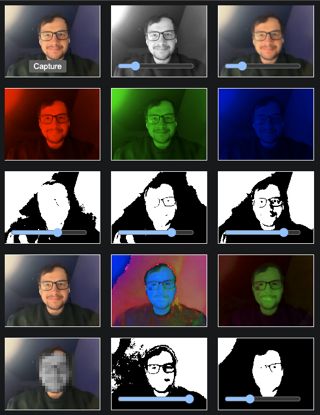

# Graphics programming coursework
Quick demo of a graphics programming project for the final project of the course.

## Description

## Included Filters
This project includes several filters that enhance the graphics processing capabilities. Below is a brief description of each filter:

1. **Gaussian Blur**: Applies a Gaussian blur to smooth out the image, reducing noise and detail.
2. **Sharpen**: Enhances the edges in the image, making it appear clearer and more defined.
3. **Sepia Tone**: Applies a warm, brownish tone to the image, giving it a vintage feel.
4. **Grayscale**: Converts the image to shades of gray, removing all color information.
5. **Invert Colors**: Inverts the colors in the image, creating a negative effect.
6. **Red Channel**: Extracts and displays the red channel of the image.
7. **Green Channel**: Extracts and displays the green channel of the image.
8. **Blue Channel**: Extracts and displays the blue channel of the image.
9. **Threshold Filters**: Applies various thresholding techniques based on color channels (red, green, blue) and HSV color space.
10. **Face Detection**: Detects faces in the image and applies pixelation to the detected areas.
11. **Color Space Conversions**: Converts images to different color spaces (e.g., Lab, HSV).

These filters can be applied individually or in combination to achieve various visual effects.

## Privacy Notice
This project does not store any personal data. All processing is done locally, and no user information is collected or transmitted.
